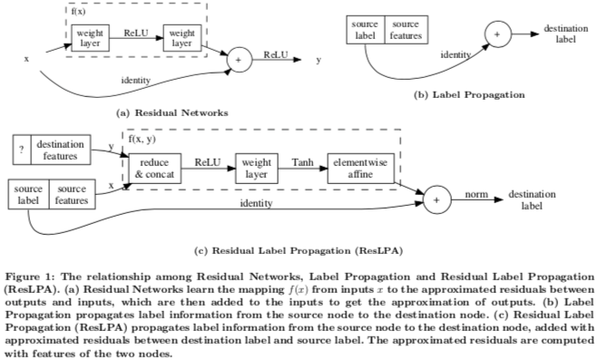
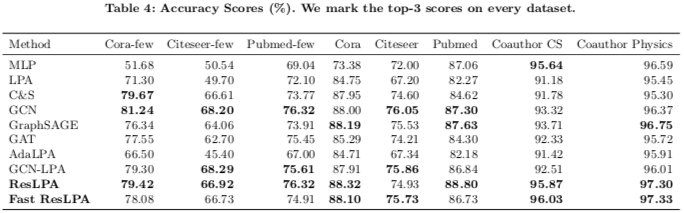

# ResLPA: Label Propagation With Residual Learning

***Residual Label Propagation Algorithm (ResLPA)*** approximates residuals between propagated labels with node feature information.
Those approximated residuals are added to labels as corrections to improve the accuracy of vanilla LPA.



In experiments on five real-world graphs, ResLPA matches SotA LPA-based methods, GCN-based methods and their integrations.



[My presentation of ResLPA on conference ICCAI2021](https://youtu.be/Bs0Jxc4Q64I)

## Reproducibility

Install dependencies [torch](https://pytorch.org/) and [DGL](https://github.com/dmlc/dgl):

```bash
pip3 install -r requirements.txt
```

Run the script with arguments `algorithm_name`, `dataset_name` and whether to split the dataset into 60%/20%/20%.

The following command experiments **Fast ResLPA** on **Cora** dataset using the default split (a training set containing 20 nodes for each class, a validation set of 500 nodes and a test set of 1000 nodes):

```bash
python3 main.py fastreslpa cora false
```

This command runs the baseline **C&S** on **Coauthor CS** dataset split into 60% as the training set, 20% as the validation set and 20% as the test set.

```bash
python3 main.py cs coauthor-cs true
```

* available algorithms: mlp / lpa / cs / gcn / sage / gat / adalpa / gcnlpa / reslpa / fastreslpa
* available datasets: cora / citeseer / pubmed / coauthor-cs / coauthor-phy

## Citation

```bibtex
@inproceedings{DBLP:conf/iccai/LuoHCZ21,
  author    = {Yi Luo and
               Rui Huang and
               Aiguo Chen and
               Xi Zeng},
  title     = {ResLPA: Label Propagation With Residual Learning},
  booktitle = {{ICCAI} '21: 2021 7th International Conference on Computing and Artificial
               Intelligence, Tianjin China, April 23 - 26, 2021},
  pages     = {296--301},
  publisher = {{ACM}},
  year      = {2021},
  url       = {https://doi.org/10.1145/3467707.3467752},
  doi       = {10.1145/3467707.3467752},
  timestamp = {Tue, 28 Sep 2021 15:58:51 +0200},
  biburl    = {https://dblp.org/rec/conf/iccai/LuoHCZ21.bib},
  bibsource = {dblp computer science bibliography, https://dblp.org}
}
```
